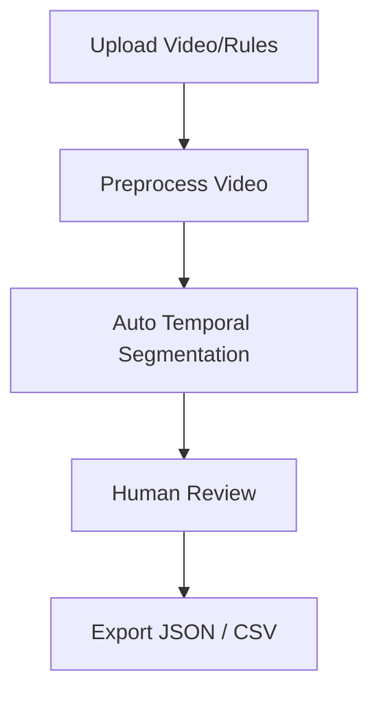
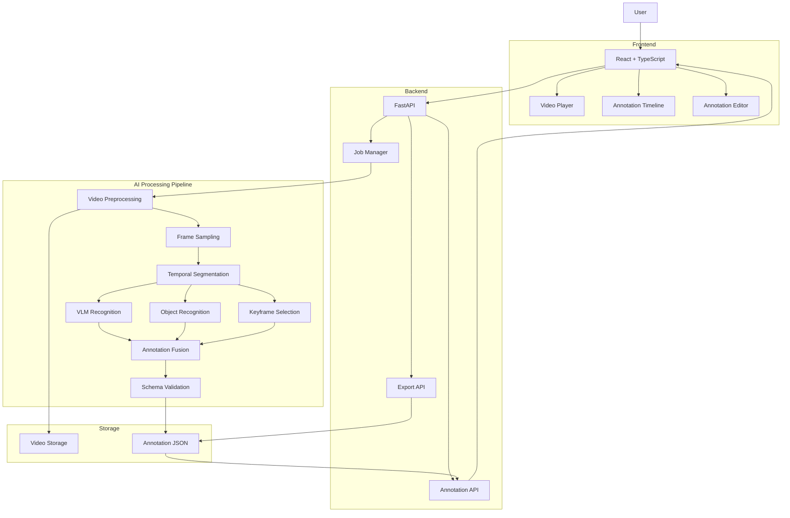
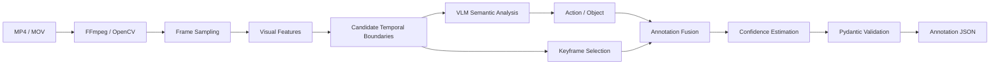
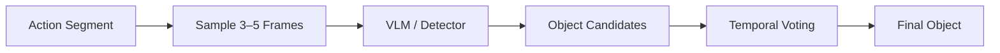
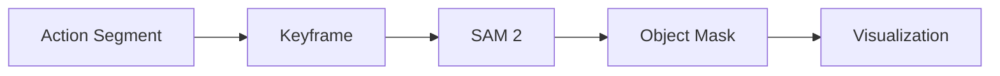
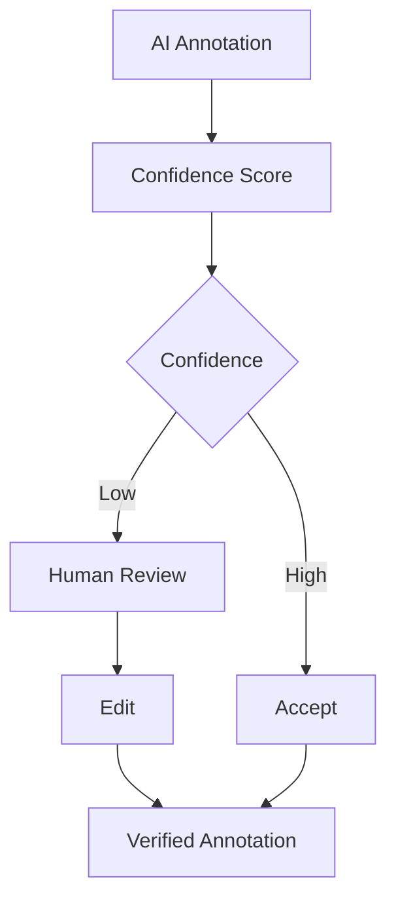
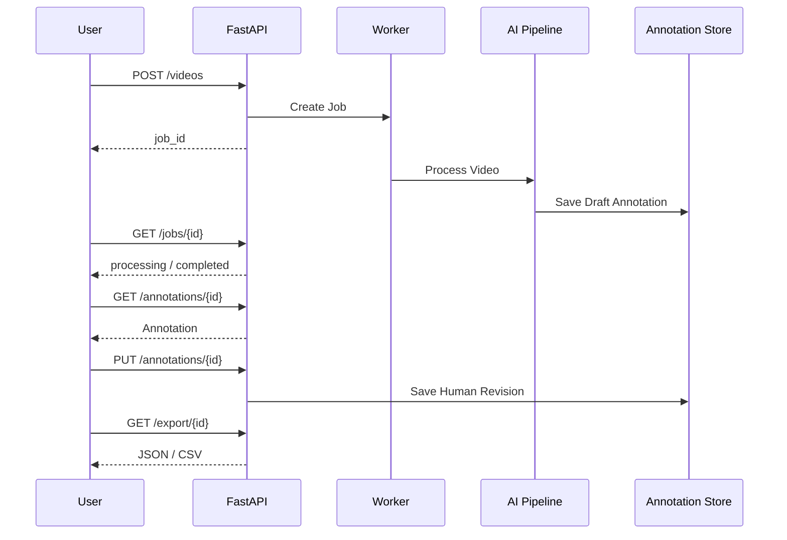
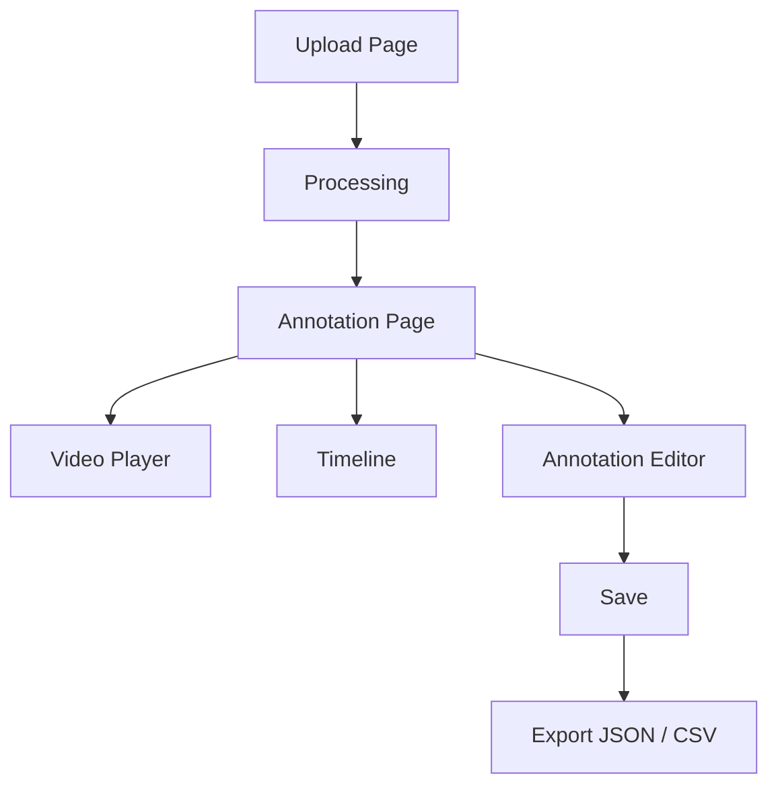

# AI Video Action Annotation System

AI Talent Hack 2026

> AI Generrated content, Haven't reviewed yet

## 1. Project Overview

### 1.1 Project Background

This project targets video data annotation scenarios in computer vision and robot learning.

Currently, human annotators need to manually watch videos containing human actions and perform the following tasks:

1. Divide the video into multiple action steps;
2. Determine the start and end time of each action;
3. Identify the action type;
4. Identify the objects involved in the action;
5. Select representative keyframes for each action;
6. Export the final annotations as JSON or CSV.

For a short video of 5–30 seconds, manual annotation typically takes approximately 15–30 minutes. Therefore, constructing large-scale video datasets requires significant human labor.

The goal of this project is **not to completely replace human annotation**, but to use AI to automatically generate a high-quality **AI-generated draft annotation**, which can then be quickly reviewed and corrected by an expert.

The final workflow is:

```text
Video

  ↓

AI-generated annotation

  ↓

Human verification

  ↓

Corrected annotation

  ↓

JSON / CSV

  ↓

Future robot learning dataset
```

### 1.2 Project Goals

Build a web application that provides an end-to-end workflow for short-video action annotation:

```text
Video Upload

   ↓

Automatic Video Analysis

   ↓

Action Temporal Segmentation

   ↓

Action Recognition

   ↓

Object Recognition

   ↓

Keyframe Selection

   ↓

Timeline Visualization

   ↓

Human Review and Editing

   ↓

JSON / CSV Export
```

## 1.3 How to Run the Presentation (Demo)

The project includes an HTML-based Pitch Deck presentation located in the `docs` folder.

To view the presentation locally:

1. Open your terminal and navigate to the `docs` directory:
   ```bash
   cd docs
   ```
2. Start a local HTTP server using Python:
   ```bash
   python -m http.server 8080
   ```
3. Open your web browser and go to:
   ```text
   http://localhost:8080/demo.html
   ```

*Note: The presentation is built with Reveal.js and is optimized for a 16:9 aspect ratio. It does not require any additional installations.*

---

# 2. Business Objectives

## 2.1 Users

The system is primarily intended for:

* ML Engineers
* Computer Vision Engineers
* Data Annotators

## 2.2 User Workflow



## 2.3 Core Business Value

Manual annotation:

```text
15–30 min / video
```

Target:

```text
AI processing + Human verification < 1/3 of manual annotation time
```

For example:

```text
Manual annotation:

20 min

AI processing:

~1 min

Human verification:

~3–4 min

Total:

~4–5 min

Speedup:

~4×–5×
```

The minimum target is:

$$
\text{Speedup} \geq 3
$$

---

# 3. Functional Scope

## 3.1 MVP Must-Have Features

| Feature             | Priority |
| ------------------- | -------: |
| Video Upload        |       P0 |
| Video Preprocessing |       P0 |
| Action Segmentation |       P0 |
| Action Recognition  |       P0 |
| Object Recognition  |       P0 |
| Keyframe Selection  |       P0 |
| Timeline            |       P0 |
| Annotation Editor   |       P0 |
| JSON Export         |       P0 |
| CSV Export          |       P0 |

## 3.2 Recommended Features

| Feature                     | Priority |
| --------------------------- | -------: |
| Confidence Score            |       P1 |
| AI / Human Source           |       P1 |
| Annotation Versioning       |       P1 |
| Evaluation Pipeline         |       P1 |
| Processing Time Measurement |       P1 |
| Low-confidence Highlighting |       P1 |

## 3.3 Implement If Time Allows

| Feature                   | Priority |
| ------------------------- | -------: |
| SAM 2 Visualization       |       P2 |
| Object Mask               |       P2 |
| Hand/Object Tracking      |       P2 |
| Uncertainty Visualization |       P2 |

## 3.4 Explicitly Out of Scope

The following features are not part of the Hackathon MVP:

* Robot Control
* ROS
* Robot Simulation
* 3D Trajectory Reconstruction
* Inverse Kinematics
* Force Estimation
* Training a Large Model from Scratch
* Production-scale Kubernetes
* User Authentication
* Billing
* Enterprise Integration

---

# 4. Overall Technical Architecture

The system adopts a **frontend-backend separation + AI pipeline + human-in-the-loop** architecture.



---

# 5. Core Design Principles

## 5.1 Do Not Train a Large Model from Scratch

Given that the development period is only approximately five days, the project will not involve:

```text
Large-scale dataset

        ↓

Model training

        ↓

Hyperparameter tuning

        ↓

Production deployment
```

Instead, the system will use:

```text
Pre-trained Models

       +

VLM / API

       +

Lightweight Temporal Algorithms

       +

Human-in-the-loop
```

This allows the majority of development effort to be focused on the **complete system pipeline** rather than model training.

---

# 6. AI Pipeline

## 6.1 Pipeline Overview



---

# 7. Video Preprocessing

Input requirements:

* MP4 / MOV
* 720p or higher
* 5–30 seconds
* Single person
* No video editing
* No complex industrial operations

The video is first standardized:

```text
Input Video

    ↓

FFmpeg

    ↓

Normalize FPS

    ↓

Normalize Resolution

    ↓

Extract Metadata

    ↓

Frame Sampling
```

Metadata is stored as:

```json
{
  "video_id": "demo_001",
  "duration": 18.42,
  "fps": 30,
  "width": 1280,
  "height": 720
}
```

---

# 8. Frame Sampling

It is not necessary to process every frame of the video.

For example:

```text
30 FPS

↓

Sampling

↓

2 FPS
```

For a 30-second video:

$$
30 \times 2 = 60
$$

Only approximately 60 frames need to be processed.

Recommended initial sampling rate:

```text
1–2 FPS
```

If higher boundary precision is required for segmentation, local high-frequency sampling can be performed around candidate boundaries.

For example:

```text
Global sampling:

2 FPS

Candidate boundary detected:

t = 7.0 sec

Local refinement:

6.0–8.0 sec

↓

10 FPS
```

This approach reduces computational cost while improving temporal boundary precision.

---

# 9. Temporal Action Segmentation

## 9.1 Problem Definition

Input:

$$
V = \{f_1, f_2, ..., f_n\}
$$

Output:

$$
S = \{s_1, s_2, ..., s_k\}
$$

where:

$$
s_i = (t_i^{start}, t_i^{end})
$$

For example:

```text
0.0 ─────── 4.5 ───────── 10.2 ───────── 15.8

    Action 1       Action 2        Action 3
```

---

## 9.2 Hybrid Segmentation

Instead of relying on a VLM to directly predict precise temporal boundaries, the system uses:

```text
Visual Change Detection

+

Semantic VLM Analysis

+

Temporal Smoothing
```

Architecture:


---

## 9.3 Visual Embedding Distance

For consecutive frames:

$$
e_i = Encoder(f_i)
$$

Cosine distance is used:

$$
d_i =
1 -
\frac{e_i \cdot e_{i+1}}
{\|e_i\|\|e_{i+1}\|}
$$

This produces a signal such as:

```text
time

 ↓

d(t)

      ▲

      │       boundary

      │          │

 0.8  │          █

 0.6  │          █

 0.4  │     █    █

 0.2  │ █   █    █   █

 0.0  └────────────────────
```

The distance signal is processed using:

1. Smoothing
2. Thresholding
3. Peak detection
4. Minimum segment duration filtering

This produces candidate boundaries.

---

# 10. VLM Semantic Validation

Visual change detection can only identify:

> “A significant visual change has occurred.”

It cannot guarantee:

> “A new action has started.”

For example:

```text
Hand moves

↓

Hand stops

↓

Drinking
```

The visual change may be relatively small.

Therefore:

```text
Visual Signal

      +

VLM Semantic Understanding

      ↓

Action Boundary
```

VLM input:

```text
Video segment / sampled frames
```

The output is strictly constrained to a predefined ontology.

For example:

```json
{
  "action": "pour",
  "object": "cup",
  "confidence": 0.91
}
```

---

# 11. Action Ontology

To prevent the VLM from producing many semantically similar but syntactically different labels, actions must not be generated freely.

For example:

```python
ACTIONS = [
    "pick",
    "place",
    "move",
    "open",
    "close",
    "pour",
    "cut",
    "stir",
    "wash"
]
```

Objects:

```python
OBJECTS = [
    "cup",
    "bottle",
    "plate",
    "knife",
    "spoon",
    "box",
    "drawer"
]
```

The VLM must select labels from a finite vocabulary.

---

# 12. Action Representation

The recommended representation follows an approach similar to EPIC-KITCHENS:

```text
Verb + Noun
```

Examples:

```text
pick + cup

pour + water

open + drawer

cut + tomato
```

Final representation:

```json
{
  "action": "pick",
  "object": "cup"
}
```

This design has two advantages:

1. It reduces annotation label inconsistency;
2. It makes future mapping to robot skills easier.

---

# 13. Object Recognition

Object recognition can be performed using a VLM or combined with a dedicated detector.

Recommended approach:



For example:

```text
Frame 1 → cup 0.91

Frame 2 → cup 0.94

Frame 3 → cup 0.88

Frame 4 → bottle 0.11

                ↓

Final:

cup
```

This is more stable than relying on a single-frame prediction.

---

# 14. Keyframe Selection

For each action segment:

$$
[t_{start}, t_{end}]
$$

several candidate frames are generated.

For example:

```text
start ───────────────────── end

  │        │       │        │

  f1       f2      f3       f4
```

A scoring function can be defined as:

$$
Score(f) =
w_1 S_{semantic}
+
w_2 S_{visibility}
+
w_3 S_{sharpness}
$$

where:

* \(S_{semantic}\): whether the frame represents the action
* \(S_{visibility}\): whether the hand and object are clearly visible
* \(S_{sharpness}\): image sharpness

For the Hackathon MVP, this can be simplified to:

```text
Segment

 ↓

Middle frames

 ↓

Sharpness filtering

 ↓

Best frame
```

---

# 15. Role of SAM 2

SAM 2 should **not** be used as the core action recognition model.

It is more suitable for:

```text
Object segmentation

Object tracking

Hand/object visualization
```

Optional architecture:



If time is limited, SAM 2 can be completely omitted.

The system should therefore treat it as an optional module:

```text
Core Pipeline

    +

Optional SAM 2 Module
```

---

# 16. Confidence Estimation

Each annotation should include a confidence score.

For example:

```json
{
  "action": "pour",
  "object": "cup",
  "confidence": 0.86
}
```

Multiple signals can be combined:

$$
C =
w_a C_{action}
+
w_o C_{object}
+
w_t C_{temporal}
$$

where:

* \(C_{action}\): action recognition confidence
* \(C_{object}\): object recognition confidence
* \(C_{temporal}\): temporal segmentation confidence

---

# 17. Confidence-Driven Human Review

This is an important product feature.

The user does not need to re-check every annotation. Instead, the system prioritizes low-confidence results.



For example:

```text
Action: pick

Object: cup

Confidence: 0.94

Status: Accepted


Action: pour

Object: bottle

Confidence: 0.51

Status: Review Required
```

This directly supports the business objective:

> AI does not need to be 100% correct. It needs to make human annotation at least 3× faster.

---

# 18. Human-in-the-Loop

The system is not:

```text
Video → AI → Final Dataset
```

Instead:

```text
Video

 ↓

AI Draft

 ↓

Human Review

 ↓

Corrected Dataset
```

AI-generated annotations should be explicitly marked as:

```json
{
  "source": "ai",
  "verified": false
}
```

After human modification:

```json
{
  "source": "human",
  "verified": true
}
```

---

# 19. Annotation Versioning

It is not recommended to directly overwrite AI-generated results.

Instead:

```text
Annotation v1

     ↓

Human Edit

     ↓

Annotation v2

     ↓

Final
```

For example:

```json
{
  "version": 2,
  "updated_by": "human",
  "verified": true
}
```

This enables the system to:

* Preserve the original AI output;
* Track human modifications;
* Support auditing;
* Use human-corrected annotations for future model training.

---

# 20. Annotation Data Model

Recommended core data structure:

```json
{
  "video_id": "demo_001",
  "duration": 18.42,
  "version": 2,
  "segments": [
    {
      "id": 1,
      "start": 0.8,
      "end": 4.7,
      "action": "pick",
      "object": "cup",
      "keyframe": 2.9,
      "confidence": 0.91,
      "source": "ai",
      "verified": true
    },
    {
      "id": 2,
      "start": 4.7,
      "end": 11.3,
      "action": "pour",
      "object": "cup",
      "keyframe": 7.6,
      "confidence": 0.86,
      "source": "human",
      "verified": true
    }
  ]
}
```

---

# 21. Pydantic Schema

The backend uses Pydantic to strictly validate annotations.

```python
from pydantic import BaseModel, Field


class AnnotationSegment(BaseModel):
    id: int
    start: float = Field(ge=0)
    end: float
    action: str
    object: str
    keyframe: float
    confidence: float = Field(ge=0, le=1)
    source: str
    verified: bool


class VideoAnnotation(BaseModel):
    video_id: str
    duration: float
    version: int
    segments: list[AnnotationSegment]
```

This ensures:

```text
AI Pipeline

      ↓

Pydantic

      ↓

Valid JSON
```

and therefore improves the reliability of JSON export.

---

# 22. Backend Architecture

Recommended technology stack:

```text
Python

FastAPI

Pydantic

FFmpeg

OpenCV
```

The API should not synchronously wait for the entire AI pipeline to finish.

Not recommended:

```text
POST /upload

      ↓

AI inference

      ↓

HTTP waits 60–120 sec

      ↓

response
```

Recommended:



---

# 23. API Design

## Upload

```http
POST /api/videos
```

Response:

```json
{
  "video_id": "demo_001",
  "job_id": "job_123",
  "status": "processing"
}
```

## Job Status

```http
GET /api/jobs/{job_id}
```

Response:

```json
{
  "job_id": "job_123",
  "status": "processing",
  "progress": 65
}
```

## Get Annotation

```http
GET /api/videos/{video_id}/annotation
```

## Update Annotation

```http
PUT /api/videos/{video_id}/annotation
```

## Export

```http
GET /api/videos/{video_id}/export?format=json
```

or:

```http
GET /api/videos/{video_id}/export?format=csv
```

---

# 24. Frontend Design

Since the Hackathon explicitly discourages excessive investment in UI, the frontend should implement only the necessary functionality.



Core page:

```text
┌─────────────────────────────────────────┐
│ Video Upload                             │
│ [ Choose File ]                          │
├─────────────────────────────────────────┤
│                                         │
│             Video Player                │
│                                         │
├─────────────────────────────────────────┤
│ Timeline                                │
│                                         │
│ ███████ Action 1 █████                  │
│                ███████ Action 2         │
│                         █████ Action 3  │
├─────────────────────────────────────────┤
│ Action: pick                             │
│ Object: cup                              │
│ Start: 0.8                               │
│ End: 4.7                                 │
│ Keyframe: [Preview]                      │
│ Confidence: 0.91                         │
│                                         │
│ [Save]                                   │
├─────────────────────────────────────────┤
│ [Export JSON] [Export CSV]              │
└─────────────────────────────────────────┘
```

---

# 25. Robot Integration

Robot control is outside the scope of the current Hackathon.

However, the annotation schema should preserve the ability to support future extensions.

Current representation:

```json
{
  "action": "pick",
  "object": "cup"
}
```

Future mapping:


For example:

```text
Human:

pick cup

        ↓

Semantic representation:

pick(cup)

        ↓

Robot skill:

grasp(cup)

        ↓

Motion planning

        ↓

Unitree G1 + Dexterous Hand
```

Therefore, the long-term positioning of the current system is:

> **Human Video → Structured Action Representation → Robot Learning Dataset**

rather than directly:

> **Video → Robot Control**

---

# 26. Dataset Strategy

The project can use either public datasets or self-recorded videos.

Recommended combination:

### Development Dataset

Record 20–50 simple videos ourselves.

For example:

```text
pick cup

place cup

pour water

open drawer

close drawer

move bottle
```

Advantages:

* The action ontology is controllable;
* Video conditions are controllable;
* Ground truth can be created quickly;
* Pipeline issues can be identified quickly.

### Public Dataset

Use:

* EPIC-KITCHENS
* Assembly101

for additional testing.

EPIC-KITCHENS is particularly suitable for verb+noun action representations, while Assembly101 is more suitable for multi-step manipulation scenarios.

---

# 27. Evaluation

## 27.1 Step-Level F1

Compare predicted action segments against ground truth.

Basic form:

$$
F_1 =
\frac{2PR}{P+R}
$$

Target:

$$
F_1 \geq 0.75
$$

---

# 28. Temporal Boundary Error

For a predicted segment:

$$
\hat{s}, \hat{e}
$$

and ground truth:

$$
s, e
$$

the following metric can be used:

$$
E_{boundary}
=
\frac{
|\hat{s}-s| + |\hat{e}-e|
}{2}
$$

Target:

$$
E_{boundary} \leq 2s
$$

In actual evaluation, it is recommended to report:

```text
Mean Start Error

Mean End Error

Mean Boundary Error
```

---

# 29. Action / Object Accuracy

Action accuracy:

$$
Accuracy_{action}
=
\frac{N_{correct\ action}}
{N_{all\ actions}}
$$

Object accuracy:

$$
Accuracy_{object}
=
\frac{N_{correct\ object}}
{N_{all\ objects}}
$$

Target:

$$
Accuracy \geq 0.80
$$

---

# 30. Processing Time

Measure:

```text
Upload

+

Preprocessing

+

AI inference

+

Postprocessing
```

Requirement:

$$
T_{processing} \leq 120s
$$

Recommended metrics:

```text
Video duration

Processing time

Real-time factor
```

For example:

```text
Video duration: 20 sec

Processing: 43 sec

RTF = 43 / 20 = 2.15
```

---

# 31. Export Validation

JSON:

```text
Generated

 ↓

Pydantic validation

 ↓

JSON serialization

 ↓

Schema validation
```

CSV:

```text
Annotation

 ↓

DataFrame

 ↓

CSV

 ↓

Column validation
```

Requirement:

$$
Export\ Success\ Rate = 100\%
$$

---

# 32. Manual Work Reduction

The final evaluation should verify:

$$
Speedup =
\frac{T_{manual}}
{T_{AI}+T_{human}}
$$

For example:

$$
T_{manual}=20min
$$

$$
T_{AI}=1min
$$

$$
T_{human}=3min
$$

Then:

$$
Speedup =
\frac{20}{1+3}=5
$$

Therefore:

```text
5× faster
```

which exceeds the requirement:

$$
Speedup \geq 3
$$

---

# 33. Three-Person Team Technical Responsibilities

## AI Engineer 1 — AI Pipeline

Responsibilities:

```text
Video preprocessing

Frame sampling

Visual embeddings

Temporal segmentation

VLM integration

Action recognition

Object recognition

Keyframe selection

Confidence estimation

Annotation schema
```

Core interface:

```python
annotation = pipeline.process(video_path)
```

Goal:

```text
Video

 ↓

Annotation JSON
```

---

## AI Engineer 2 — Backend / Frontend / Integration

Responsibilities:

```text
FastAPI

Video Upload

Job Management

Annotation CRUD

JSON / CSV Export

React UI

Timeline

Annotation Editor

AI Pipeline Integration
```

Core goal:

```text
Browser

 ↓

FastAPI

 ↓

AI Pipeline

 ↓

Annotation
```

---

## AI Product

Responsibilities:

```text
Action / Object Ontology

User Journey

Business Requirements

Evaluation Dataset

Ground Truth

Evaluation Metrics

Demo Scenario

Product Narrative

Final Presentation
```

The product role also coordinates:

```text
AI quality

+

UX

+

Business value
```

---

# 34. Git Repository Structure

Recommended structure:

```text
video-annotation/

│
├── backend/
│   ├── app/
│   │   ├── api/
│   │   │   ├── videos.py
│   │   │   ├── jobs.py
│   │   │   ├── annotations.py
│   │   │   └── export.py
│   │   │
│   │   ├── models/
│   │   │   └── annotation.py
│   │   │
│   │   ├── services/
│   │   │   ├── video_service.py
│   │   │   └── annotation_service.py
│   │   │
│   │   └── main.py
│   │
│   └── requirements.txt
│
├── ai/
│   ├── pipeline.py
│   ├── preprocessing.py
│   ├── sampling.py
│   ├── segmentation.py
│   ├── recognition.py
│   ├── keyframe.py
│   ├── confidence.py
│   └── prompts/
│       └── annotation_prompt.txt
│
├── frontend/
│   ├── src/
│   │   ├── components/
│   │   ├── pages/
│   │   ├── api/
│   │   └── types/
│   └── package.json
│
├── data/
│   ├── demo/
│   └── evaluation/
│
├── tests/
│   ├── test_pipeline.py
│   ├── test_annotation.py
│   └── test_export.py
│
├── docs/
│   ├── architecture.md
│   └── evaluation.md
│
├── docker-compose.yml
├── README.md
└── .gitignore
```

---

# 35. Five-Day Development Plan

## Day 1 — Risk Reduction

Goal:

> **Video → Annotation JSON**

### AI Engineer 1

Complete:

```text
Video preprocessing

Frame sampling

Segmentation PoC

VLM PoC

Action/Object recognition

JSON schema
```

### AI Engineer 2

Complete:

```text
FastAPI skeleton

Video upload

Job model

Job status API
```

### AI Product

Complete:

```text
Ontology

Evaluation criteria

Demo scenarios

Ground truth definition

Product flow
```

### Day 1 Acceptance Criteria

The system must be able to:

```text
upload.mp4

     ↓

AI pipeline

     ↓

annotation.json
```

Even if the UI is not yet complete.

---

# 36. Day 2 — Stabilize the AI Pipeline

Goal:

```text
Video

 ↓

Segmentation

 ↓

Recognition

 ↓

Keyframe

 ↓

Confidence

 ↓

Valid JSON
```

Focus areas:

* Improve temporal boundaries;
* Constrain the action/object vocabulary;
* Optimize VLM prompts;
* Test 5–10 videos;
* Measure processing time.

By the end of Day 2:

```python
annotation = pipeline.process(video)
```

should run reliably.

---

# 37. Day 3 — Human-in-the-Loop

Goal:

```text
AI Annotation

 ↓

Timeline

 ↓

Edit

 ↓

Save

 ↓

Export
```

### Engineer 1

Focus:

```text
AI Pipeline stabilization

API integration

Confidence
```

### Engineer 2

Focus:

```text
Video Player

Timeline

Annotation Editor

Export
```

### Product

Focus:

```text
UX testing

Ground truth

Evaluation

Demo narrative
```

---

# 38. Day 4 — Evaluation & Robustness

Stop large-scale development of new features.

Focus:

```text
Benchmark

 ↓

Find bottleneck

 ↓

Optimize

 ↓

Regression test
```

Record:

| Metric                |    Target |
| --------------------- | --------: |
| Step F1               |    ≥ 0.75 |
| Boundary Error        |   ≤ 2 sec |
| Action Accuracy       |     ≥ 80% |
| Object Accuracy       |     ≥ 80% |
| Processing Time       | ≤ 120 sec |
| Export Success        |      100% |
| Manual Work Reduction |      ≥ 3× |

If:

```text
Action accuracy = 92%

Object accuracy = 88%

Step F1 = 0.58
```

do not continue optimizing classification.

The main focus should instead be:

```text
Temporal Segmentation
```

---

# 39. Day 5 — Demo & Presentation

Day 5 principle:

> **Do not make high-risk architectural changes.**

Workflow:


Prepare at least:

```text
Demo Video 1

Demo Video 2

Demo Video 3
```

Also prepare an offline fallback:

```text
Precomputed annotation
```

If the API, GPU, or network fails during the presentation, the demo can still be completed.

---

# 40. Demo Scenario

A simple and easy-to-understand action sequence is recommended.

For example:

```text
Pick up cup

      ↓

Pour water

      ↓

Place cup
```

The user uploads a video.

The system displays:

```text
Processing...

Extracting frames

Detecting actions

Recognizing objects

Selecting keyframes
```

Result:

```text
00:00 – 04:20

PICK / CUP

04:20 – 10:30

POUR / CUP

10:30 – 15:80

PLACE / CUP
```

Then intentionally demonstrate one AI error:

```text
AI prediction:

POUR / BOTTLE

confidence = 0.51
```

The user corrects it:

```text
BOTTLE → CUP
```

Then:

```text
Save

 ↓

Verified = true

 ↓

Export JSON
```

This demonstrates the complete end-to-end workflow.

---

# 41. Final Demo Story

The demo should not focus primarily on:

```text
Which models we used
```

Instead, it should demonstrate:

```text
Problem

 ↓

Manual annotation takes 15–30 minutes

 ↓

AI generates draft annotation

 ↓

Human only checks uncertain segments

 ↓

Annotation corrected in seconds

 ↓

Export dataset

 ↓

Future robot learning
```

The key message is:

> **The system does not try to remove the human from the loop. It removes unnecessary manual work.**

---

# 42. Key Trade-offs in System Design

## 42.1 VLM vs. Dedicated Action Recognition Model

### Dedicated Model

Advantages:

* Stable inference;
* Predictable latency;
* Can be optimized for a specific dataset.

Disadvantages:

* Requires training;
* Fixed ontology;
* Insufficient time for training during the Hackathon.

### VLM

Advantages:

* Zero-shot / few-shot capabilities;
* Fast development;
* More flexible for new actions.

Disadvantages:

* Weaker temporal precision;
* Potentially higher latency / cost;
* Output requires schema constraints.

Therefore, the final architecture uses:

```text
VLM

+

Temporal Algorithm
```

---

# 43. Why Not Let the VLM Do Everything?

Because:

```text
VLM

 ↓

"Person picks up a cup around 2 seconds"
```

does not necessarily mean:

```text
start = 1.87

end = 4.31
```

Temporal boundaries require a more stable temporal signal.

Therefore:

```text
Temporal Algorithm

      +

VLM
```

is more suitable for this project than:

```text
VLM alone
```

---

# 44. Why Is Human-in-the-Loop Necessary?

The objective is not:

$$
Accuracy = 100\%
$$

Instead:

$$
Cost_{AI+Human}
<
\frac{1}{3}Cost_{Manual}
$$

Even if the AI makes some errors, the system can still provide significant business value as long as:

```text
AI generates 80–90% correct draft

+

Human quickly fixes remaining errors
```

---

# 45. Future Extensions

Current system:

```text
Video

 ↓

Structured Annotation
```

Future architecture:


Potential future extensions include:

* SAM 2 object tracking;
* Hand-object interaction;
* Object trajectory;
* Robot skill mapping;
* Demonstration learning;
* Imitation Learning;
* VLA models.

However, these are outside the scope of the current Hackathon MVP.

---

# 46. Final Technical Solution Summary

The recommended final architecture is:

```text
                 ┌──────────────────┐
                 │    Video Input   │
                 └────────┬─────────┘
                          ↓
                 ┌──────────────────┐
                 │ Preprocessing    │
                 │ FFmpeg / OpenCV  │
                 └────────┬─────────┘
                          ↓
                 ┌──────────────────┐
                 │ Frame Sampling   │
                 └────────┬─────────┘
                          ↓
                 ┌──────────────────┐
                 │ Temporal Signal  │
                 │ Embedding Change │
                 └────────┬─────────┘
                          ↓
                 ┌──────────────────┐
                 │ Candidate        │
                 │ Segmentation     │
                 └────────┬─────────┘
                          ↓
                 ┌──────────────────┐
                 │ VLM Semantic     │
                 │ Recognition      │
                 └────────┬─────────┘
                          ↓
             ┌────────────┼────────────┐
             ↓            ↓            ↓
          Action        Object      Keyframe
             │            │            │
             └────────────┼────────────┘
                          ↓
                 ┌──────────────────┐
                 │ Confidence       │
                 │ Estimation       │
                 └────────┬─────────┘
                          ↓
                 ┌──────────────────┐
                 │ Annotation JSON  │
                 └────────┬─────────┘
                          ↓
                 ┌──────────────────┐
                 │ Human Review     │
                 └────────┬─────────┘
                          ↓
                 ┌──────────────────┐
                 │ Versioned        │
                 │ Annotation       │
                 └────────┬─────────┘
                          ↓
                  ┌───────┴────────┐
                  ↓                ↓
              JSON Export      CSV Export
                  │
                  ↓
          Future Robot Dataset
```

The core principles can be summarized as follows:

1. **Do not train a large model from scratch.**
2. **Temporal Segmentation is the core technical challenge of the AI pipeline.**
3. **Use a hybrid architecture combining visual signals and VLMs.**
4. **Use a constrained ontology for actions and objects instead of free-form text.**
5. **Let the VLM handle semantic understanding rather than relying on it alone for precise temporal localization.**
6. **Treat SAM 2 as an optional module rather than a core dependency.**
7. **AI output must be treated as a draft, with human verification as an integral part of the system workflow.**
8. **Use confidence-driven human review to maximize annotation efficiency.**
9. **Use structured JSON with Pydantic validation for annotations.**
10. **Use asynchronous jobs on the backend to avoid long-running HTTP blocking.**
11. **Implement only Timeline + Editor + Export in the UI instead of investing heavily in visual design.**
12. **Avoid high-risk technical changes on Day 5.**
13. **The final demo should demonstrate the complete business workflow rather than merely showing model predictions.**
14. **Reserve architectural capacity for Robot Skill Mapping, but do not implement robot control in the current MVP.**

Final product positioning:

> **An AI-assisted, human-in-the-loop video annotation system that converts human demonstrations into structured action datasets for future computer vision and robot learning applications.**
