# AI Video Action Annotation System

AI Talent Hack 2026

## 1. 项目概述

### 1.1 项目背景

本项目面向计算机视觉和机器人学习中的视频数据标注场景。

当前，工作人员需要人工观看包含人类操作的视频，并手动完成以下工作：

1. 将视频划分为多个动作步骤；
2. 确定每个动作的开始和结束时间；
3. 判断动作类型；
4. 判断动作涉及的对象；
5. 为每个动作选择代表性关键帧；
6. 最终将标注结果导出为 JSON 或 CSV。

对于一个 5–30 秒的短视频，人工标注通常需要约 15–30 分钟。因此，大规模视频数据集的构建具有较高的人力成本。

本项目的目标不是完全取代人工标注，而是通过 AI 自动生成一个高质量的**初始标注结果（AI-generated draft annotation）**，然后由专家快速检查和修正。

最终形成：

```text
Video
  ↓
AI-generated annotation
  ↓
Human verification
  ↓
Corrected annotation
  ↓
JSON / CSV
  ↓
Future robot learning dataset
```

### 1.2 项目目标

构建一个 Web 应用，实现短视频动作标注的完整闭环：

```text
视频上传
   ↓
自动视频分析
   ↓
动作时间分段
   ↓
Action Recognition
   ↓
Object Recognition
   ↓
Keyframe Selection
   ↓
时间轴可视化
   ↓
人工检查与修改
   ↓
JSON / CSV Export
```

---

# 2. 业务目标

## 2.1 用户

系统主要面向：

* ML Engineer
* Computer Vision Engineer
* Data Annotator

## 2.2 用户流程

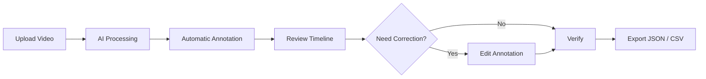

## 2.3 核心业务价值

人工标注：

```text
15–30 min / video
```

目标：

```text
AI processing
+
Human verification
<
1/3 of manual annotation time
```

例如：

```text
Manual annotation:
20 min

AI processing:
~1 min

Human verification:
~3–4 min

Total:
~4–5 min

Speedup:
~4×–5×
```

最终目标是至少实现：

$$
\text{Speedup} \geq 3
$$

---

# 3. 功能范围

## 3.1 MVP 必须实现

| 功能                  | 优先级 |
| ------------------- | --: |
| Video Upload        |  P0 |
| Video Preprocessing |  P0 |
| Action Segmentation |  P0 |
| Action Recognition  |  P0 |
| Object Recognition  |  P0 |
| Keyframe Selection  |  P0 |
| Timeline            |  P0 |
| Annotation Editor   |  P0 |
| JSON Export         |  P0 |
| CSV Export          |  P0 |

## 3.2 推荐实现

| 功能                          | 优先级 |
| --------------------------- | --: |
| Confidence Score            |  P1 |
| AI / Human Source           |  P1 |
| Annotation Versioning       |  P1 |
| Evaluation Pipeline         |  P1 |
| Processing Time Measurement |  P1 |
| Low-confidence Highlighting |  P1 |

## 3.3 有时间再实现

| 功能                        | 优先级 |
| ------------------------- | --: |
| SAM 2 Visualization       |  P2 |
| Object Mask               |  P2 |
| Hand/Object Tracking      |  P2 |
| Uncertainty Visualization |  P2 |

## 3.4 明确不实现

以下功能不属于 Hackathon MVP：

* Robot Control
* ROS
* Robot Simulation
* 3D Trajectory Reconstruction
* Inverse Kinematics
* Force Estimation
* Training a Large Model from Scratch
* Production-scale Kubernetes
* User Authentication
* Billing
* Enterprise Integration

---

# 4. 总体技术架构

系统采用前后端分离 + AI Pipeline + Human-in-the-loop 架构。

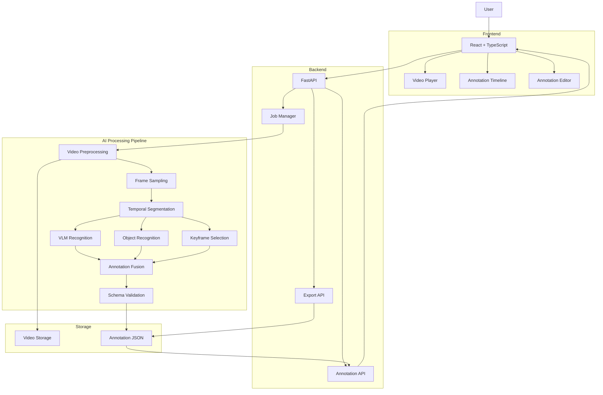

---

# 5. 核心设计原则

## 5.1 不从零训练大模型

由于开发周期只有约 5 天，不进行：

```text
Large-scale dataset
        ↓
Model training
        ↓
Hyperparameter tuning
        ↓
Production deployment
```

而采用：

```text
Pre-trained Models
       +
VLM / API
       +
Lightweight Temporal Algorithms
       +
Human-in-the-loop
```

这样能够将主要开发时间投入到**完整系统链路**而不是模型训练。

---

# 6. AI Pipeline

## 6.1 Pipeline 总览

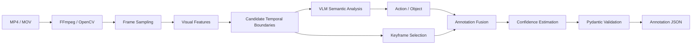

---

# 7. Video Preprocessing

输入要求：

* MP4 / MOV
* 720p 或以上
* 5–30 秒
* 单人
* 无视频剪辑
* 无复杂生产操作

视频首先进行标准化处理：

```text
Input Video
    ↓
FFmpeg
    ↓
Normalize FPS
    ↓
Normalize Resolution
    ↓
Extract Metadata
    ↓
Frame Sampling
```

保存：

```json
{
  "video_id": "demo_001",
  "duration": 18.42,
  "fps": 30,
  "width": 1280,
  "height": 720
}
```

---

# 8. Frame Sampling

不需要处理视频的每一帧。

例如：

```text
30 FPS
↓
Sampling
↓
2 FPS
```

对于 30 秒视频：

$$
30 \times 2 = 60
$$

只需要处理约 60 帧。

推荐初始采样率：

```text
1–2 FPS
```

如果 segmentation 对边界精度要求较高，可以在候选边界附近进行局部高频采样。

例如：

```text
Global sampling:
2 FPS

Candidate boundary detected:
t = 7.0 sec

Local refinement:
6.0–8.0 sec
↓
10 FPS
```

这样可以同时降低计算成本并提高时间边界精度。

---

# 9. Temporal Action Segmentation

## 9.1 问题定义

输入：

$$
V = \{f_1, f_2, ..., f_n\}
$$

输出：

$$
S = \{s_1, s_2, ..., s_k\}
$$

其中：

$$
s_i = (t_i^{start}, t_i^{end})
$$

例如：

```text
0.0 ─────── 4.5 ───────── 10.2 ───────── 15.8
    Action 1       Action 2        Action 3
```

---

## 9.2 Hybrid Segmentation

不依赖 VLM 直接预测精确时间边界，而使用：

```text
Visual Change Detection
+
Semantic VLM Analysis
+
Temporal Smoothing
```

架构：

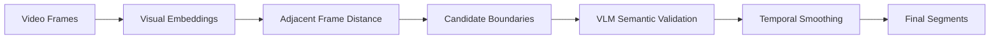

---

## 9.3 Visual Embedding Distance

对于连续帧：

$$
e_i = Encoder(f_i)
$$

使用 cosine distance：

$$
d_i = 1 -
\frac{e_i \cdot e_{i+1}}
{\|e_i\|\|e_{i+1}\|}
$$

得到：

```text
time
 ↓

d(t)

      ▲
      │       boundary
      │          │
 0.8  │          █
 0.6  │          █
 0.4  │     █    █
 0.2  │ █   █    █   █
 0.0  └────────────────────
```

对 distance signal 进行：

1. Smoothing
2. Thresholding
3. Peak detection
4. Minimum segment duration filtering

得到 candidate boundaries。

---

# 10. VLM Semantic Validation

Visual change detection只能发现：

> “画面发生了明显变化”

但不能保证：

> “一个新的动作开始了”。

例如：

```text
手移动
↓
手停止
↓
喝水
```

视觉变化可能非常小。

因此：

```text
Visual Signal
      +
VLM Semantic Understanding
      ↓
Action Boundary
```

VLM 输入：

```text
Video segment / sampled frames
```

输出严格限制在预定义 ontology 中。

例如：

```json
{
  "action": "pour",
  "object": "cup",
  "confidence": 0.91
}
```

---

# 11. Action Ontology

为了避免 VLM 输出大量语义相近但字符串不同的结果，不允许自由生成 action。

例如：

```python
ACTIONS = [
    "pick",
    "place",
    "move",
    "open",
    "close",
    "pour",
    "cut",
    "stir",
    "wash"
]
```

Object：

```python
OBJECTS = [
    "cup",
    "bottle",
    "plate",
    "knife",
    "spoon",
    "box",
    "drawer"
]
```

VLM 必须从有限 vocabulary 中选择。

---

# 12. Action Representation

推荐采用类似 EPIC-KITCHENS 的：

```text
Verb + Noun
```

表示方式。

例如：

```text
pick + cup
pour + water
open + drawer
cut + tomato
```

最终：

```json
{
  "action": "pick",
  "object": "cup"
}
```

这种设计有两个优势：

1. 降低 annotation label inconsistency；
2. 更容易映射到未来的 robot skill。

---

# 13. Object Recognition

Object recognition 可以通过 VLM 完成，也可以结合 detector。

推荐方案：

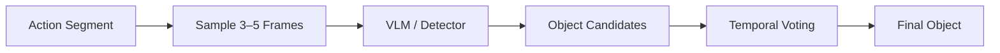

例如：

```text
Frame 1 → cup 0.91
Frame 2 → cup 0.94
Frame 3 → cup 0.88
Frame 4 → bottle 0.11

                ↓

Final:
cup
```

这样比单帧预测更加稳定。

---

# 14. Keyframe Selection

对于每个 action segment：

$$
[t_{start}, t_{end}]
$$

生成若干 candidate frames。

例如：

```text
start ───────────────────── end
  │        │       │        │
  f1       f2      f3       f4
```

可以定义：

$$
Score(f) =
w_1 S_{semantic}
+
w_2 S_{visibility}
+
w_3 S_{sharpness}
$$

其中：

* \(S_{semantic}\)：是否能代表 action
* \(S_{visibility}\)：手和对象是否清晰可见
* \(S_{sharpness}\)：图像是否清晰

Hackathon MVP 可以进一步简化为：

```text
Segment
 ↓
Middle frames
 ↓
Sharpness filtering
 ↓
Best frame
```

---

# 15. SAM 2 的定位

SAM 2 不应该作为核心 action recognition 模型。

它更适合用于：

```text
Object segmentation
Object tracking
Hand/object visualization
```

可选架构：

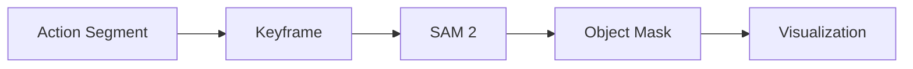

如果时间不足，可以完全不启用 SAM 2。

系统应该将其设计成 optional module：

```text
Core Pipeline
    +
Optional SAM2 Module
```

---

# 16. Confidence Estimation

每个 annotation 都应该包含 confidence。

例如：

```json
{
  "action": "pour",
  "object": "cup",
  "confidence": 0.86
}
```

可以将多个信号组合：

$$
C =
w_a C_{action}
+
w_o C_{object}
+
w_t C_{temporal}
$$

其中：

* \(C_{action}\)：action recognition confidence
* \(C_{object}\)：object recognition confidence
* \(C_{temporal}\)：temporal segmentation confidence

---

# 17. Confidence-driven Human Review

这是系统的重要产品特性。

不要求用户重新检查所有 annotation，而是重点检查低置信度结果。

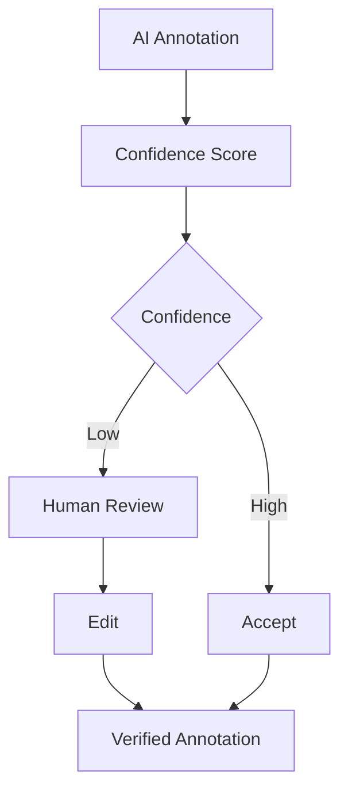

例如：

```text
Action: pick
Object: cup
Confidence: 0.94
Status: Accepted


Action: pour
Object: bottle
Confidence: 0.51
Status: Review Required
```

这直接服务于业务目标：

> AI 不需要 100% 正确，而需要让人工标注速度提高至少 3 倍。

---

# 18. Human-in-the-loop

系统不是：

```text
Video → AI → Final Dataset
```

而是：

```text
Video
 ↓
AI Draft
 ↓
Human Review
 ↓
Corrected Dataset
```

AI annotation 应明确标记为：

```json
{
  "source": "ai",
  "verified": false
}
```

人工修改后：

```json
{
  "source": "human",
  "verified": true
}
```

---

# 19. Annotation Versioning

不建议直接覆盖 AI 生成的结果。

采用：

```text
Annotation v1
     ↓
Human Edit
     ↓
Annotation v2
     ↓
Final
```

例如：

```json
{
  "version": 2,
  "updated_by": "human",
  "verified": true
}
```

这样能够：

* 保留 AI 原始结果；
* 追踪人工修改；
* 支持审计；
* 将人工修正结果用于未来模型训练。

---

# 20. Annotation Data Model

推荐核心数据结构：

```json
{
  "video_id": "demo_001",
  "duration": 18.42,
  "version": 2,
  "segments": [
    {
      "id": 1,
      "start": 0.8,
      "end": 4.7,
      "action": "pick",
      "object": "cup",
      "keyframe": 2.9,
      "confidence": 0.91,
      "source": "ai",
      "verified": true
    },
    {
      "id": 2,
      "start": 4.7,
      "end": 11.3,
      "action": "pour",
      "object": "cup",
      "keyframe": 7.6,
      "confidence": 0.86,
      "source": "human",
      "verified": true
    }
  ]
}
```

---

# 21. Pydantic Schema

后端使用 Pydantic 对 annotation 进行严格验证。

```python
from pydantic import BaseModel, Field


class AnnotationSegment(BaseModel):
    id: int
    start: float = Field(ge=0)
    end: float
    action: str
    object: str
    keyframe: float
    confidence: float = Field(ge=0, le=1)
    source: str
    verified: bool


class VideoAnnotation(BaseModel):
    video_id: str
    duration: float
    version: int
    segments: list[AnnotationSegment]
```

这样可以确保：

```text
AI Pipeline
      ↓
Pydantic
      ↓
Valid JSON
```

从而提高 JSON export 的可靠性。

---

# 22. Backend Architecture

推荐：

```text
Python
FastAPI
Pydantic
FFmpeg
OpenCV
```

API 不应该同步等待整个 AI Pipeline。

不推荐：

```text
POST /upload
      ↓
AI inference
      ↓
HTTP waits 60–120 sec
      ↓
response
```

推荐：

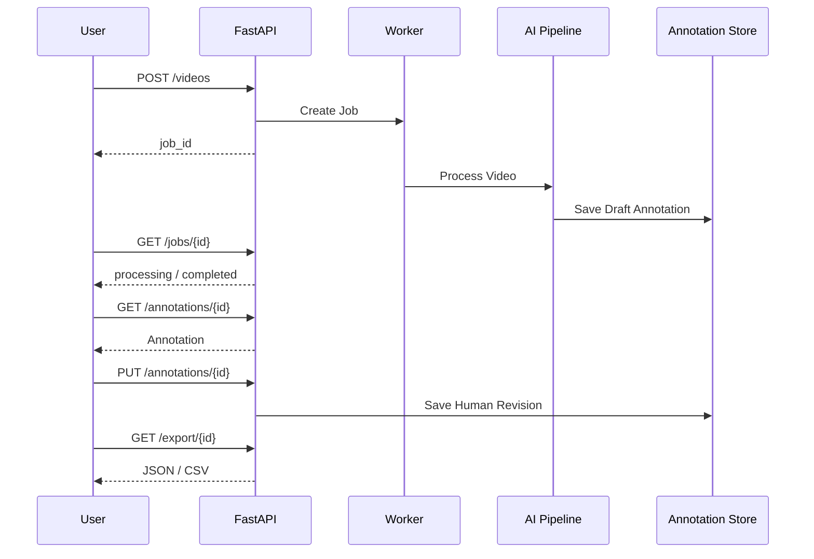

---

# 23. API Design

## Upload

```http
POST /api/videos
```

Response：

```json
{
  "video_id": "demo_001",
  "job_id": "job_123",
  "status": "processing"
}
```

## Job Status

```http
GET /api/jobs/{job_id}
```

Response：

```json
{
  "job_id": "job_123",
  "status": "processing",
  "progress": 65
}
```

## Get Annotation

```http
GET /api/videos/{video_id}/annotation
```

## Update Annotation

```http
PUT /api/videos/{video_id}/annotation
```

## Export

```http
GET /api/videos/{video_id}/export?format=json
```

或：

```http
GET /api/videos/{video_id}/export?format=csv
```

---

# 24. Frontend Design

由于 Hackathon 明确要求不要过度投入 UI，因此前端只实现必要功能。

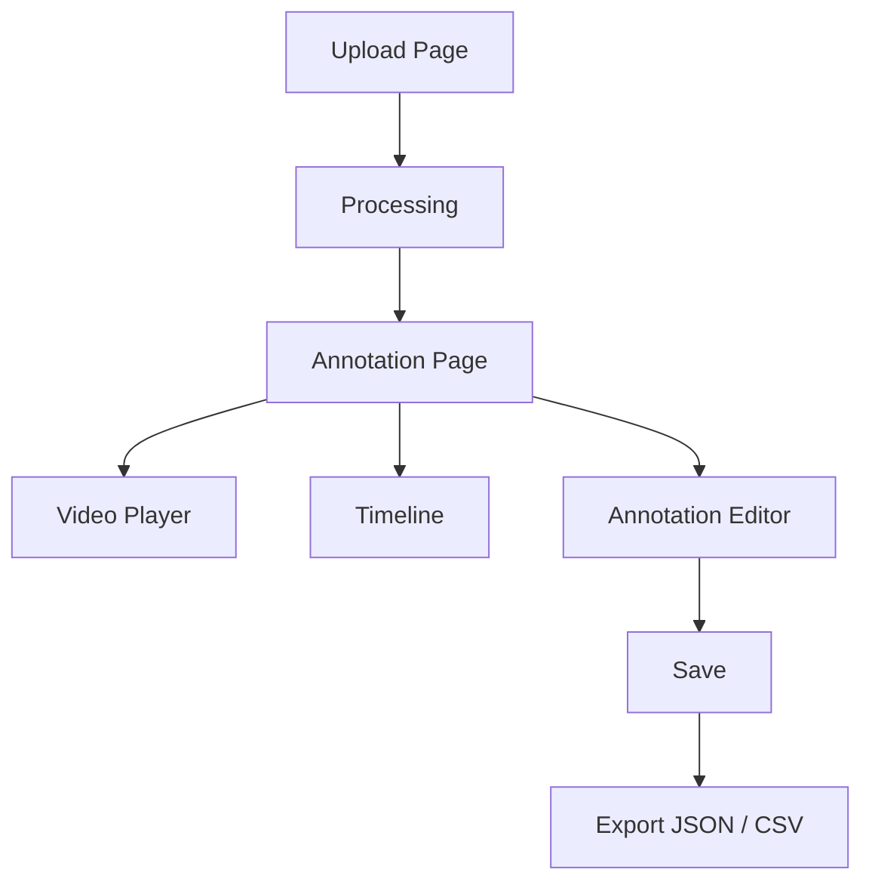

核心页面：

```text
┌─────────────────────────────────────────┐
│ Video Upload                             │
│ [ Choose File ]                          │
├─────────────────────────────────────────┤
│                                         │
│             Video Player                │
│                                         │
├─────────────────────────────────────────┤
│ Timeline                                │
│                                         │
│ ███████ Action 1 █████                  │
│                ███████ Action 2         │
│                         █████ Action 3  │
├─────────────────────────────────────────┤
│ Action: pick                             │
│ Object: cup                              │
│ Start: 0.8                               │
│ End: 4.7                                 │
│ Keyframe: [Preview]                      │
│ Confidence: 0.91                         │
│                                         │
│ [Save]                                   │
├─────────────────────────────────────────┤
│ [Export JSON] [Export CSV]              │
└─────────────────────────────────────────┘
```

---

# 25. Robot Integration

机器人控制不属于当前 Hackathon Scope。

但是 annotation schema 应该保留未来扩展能力。

当前：

```json
{
  "action": "pick",
  "object": "cup"
}
```

未来可以映射：

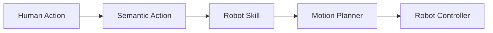

例如：

```text
Human:
pick cup

        ↓

Semantic representation:
pick(cup)

        ↓

Robot skill:
grasp(cup)

        ↓

Motion planning

        ↓

Unitree G1 + Dexterous Hand
```

因此当前系统的长期定位是：

> Human Video → Structured Action Representation → Robot Learning Dataset

而不是直接：

> Video → Robot Control

---

# 26. 数据集策略

项目允许使用公开数据集或者自行拍摄视频。

推荐组合：

### Development Dataset

自行拍摄 20–50 个简单视频。

例如：

```text
pick cup
place cup
pour water
open drawer
close drawer
move bottle
```

优点：

* action ontology 可控；
* 视频条件可控；
* 可以快速制作 ground truth；
* 可以快速定位 pipeline 问题。

### Public Dataset

使用：

* EPIC-KITCHENS
* Assembly101

进行额外测试。

EPIC-KITCHENS 特别适合 verb+noun 类型的动作表示，而 Assembly101 更适合多步骤操作场景。

---

# 27. Evaluation

## 27.1 Step-level F1

将预测的 action segments 与 ground truth 对比。

基本形式：

$$
F_1 =
\frac{2PR}{P+R}
$$

目标：

$$
F_1 \geq 0.75
$$

---

# 28. Temporal Boundary Error

对于预测 segment：

$$
\hat{s}, \hat{e}
$$

ground truth：

$$
s, e
$$

可以计算：

$$
E_{boundary}
=
\frac{
|\hat{s}-s| + |\hat{e}-e|
}{2}
$$

目标：

$$
E_{boundary} \leq 2s
$$

实际评估时建议同时报告：

```text
Mean Start Error
Mean End Error
Mean Boundary Error
```

---

# 29. Action / Object Accuracy

分别计算：

$$
Accuracy_{action}
=
\frac{N_{correct\ action}}
{N_{all\ actions}}
$$

以及：

$$
Accuracy_{object}
=
\frac{N_{correct\ object}}
{N_{all\ objects}}
$$

目标：

$$
Accuracy \geq 0.80
$$

---

# 30. Processing Time

测量：

```text
Upload
+
Preprocessing
+
AI inference
+
Postprocessing
```

要求：

$$
T_{processing} \leq 120s
$$

建议记录：

```text
Video duration
Processing time
Real-time factor
```

例如：

```text
Video duration: 20 sec
Processing: 43 sec

RTF = 43 / 20 = 2.15
```

---

# 31. Export Validation

JSON：

```text
Generated
 ↓
Pydantic validation
 ↓
JSON serialization
 ↓
Schema validation
```

CSV：

```text
Annotation
 ↓
DataFrame
 ↓
CSV
 ↓
Column validation
```

要求：

$$
Export\ Success\ Rate = 100\%
$$

---

# 32. Manual Work Reduction

最终需要验证：

$$
Speedup =
\frac{T_{manual}}
{T_{AI}+T_{human}}
$$

例如：

$$
T_{manual}=20min
$$

$$
T_{AI}=1min
$$

$$
T_{human}=3min
$$

则：

$$
Speedup =
\frac{20}{1+3}=5
$$

因此：

```text
5× faster
```

超过要求：

$$
Speedup \geq 3
$$

---

# 33. 三人团队技术分工

## AI Engineer 1 — AI Pipeline

负责：

```text
Video preprocessing
Frame sampling
Visual embeddings
Temporal segmentation
VLM integration
Action recognition
Object recognition
Keyframe selection
Confidence estimation
Annotation schema
```

核心接口：

```python
annotation = pipeline.process(video_path)
```

目标：

```text
Video
 ↓
Annotation JSON
```

---

## AI Engineer 2 — Backend / Frontend / Integration

负责：

```text
FastAPI
Video Upload
Job Management
Annotation CRUD
JSON / CSV Export
React UI
Timeline
Annotation Editor
AI Pipeline Integration
```

核心目标：

```text
Browser
 ↓
FastAPI
 ↓
AI Pipeline
 ↓
Annotation
```

---

## AI Product

负责：

```text
Action / Object Ontology
User Journey
Business Requirements
Evaluation Dataset
Ground Truth
Evaluation Metrics
Demo Scenario
Product Narrative
Final Presentation
```

同时负责协调：

```text
AI quality
+
UX
+
Business value
```

---

# 34. Git Repository Structure

推荐：

```text
video-annotation/
│
├── backend/
│   ├── app/
│   │   ├── api/
│   │   │   ├── videos.py
│   │   │   ├── jobs.py
│   │   │   ├── annotations.py
│   │   │   └── export.py
│   │   │
│   │   ├── models/
│   │   │   └── annotation.py
│   │   │
│   │   ├── services/
│   │   │   ├── video_service.py
│   │   │   └── annotation_service.py
│   │   │
│   │   └── main.py
│   │
│   └── requirements.txt
│
├── ai/
│   ├── pipeline.py
│   ├── preprocessing.py
│   ├── sampling.py
│   ├── segmentation.py
│   ├── recognition.py
│   ├── keyframe.py
│   ├── confidence.py
│   └── prompts/
│       └── annotation_prompt.txt
│
├── frontend/
│   ├── src/
│   │   ├── components/
│   │   ├── pages/
│   │   ├── api/
│   │   └── types/
│   └── package.json
│
├── data/
│   ├── demo/
│   └── evaluation/
│
├── tests/
│   ├── test_pipeline.py
│   ├── test_annotation.py
│   └── test_export.py
│
├── docs/
│   ├── architecture.md
│   └── evaluation.md
│
├── docker-compose.yml
├── README.md
└── .gitignore
```

---

# 35. 五天开发计划

## Day 1 — Risk Reduction

目标：

> **Video → Annotation JSON**

### AI Engineer 1

完成：

```text
Video preprocessing
Frame sampling
Segmentation PoC
VLM PoC
Action/Object recognition
JSON schema
```

### AI Engineer 2

完成：

```text
FastAPI skeleton
Video upload
Job model
Job status API
```

### AI Product

完成：

```text
Ontology
Evaluation criteria
Demo scenarios
Ground truth definition
Product flow
```

### Day 1 Acceptance Criteria

必须能够：

```text
upload.mp4
     ↓
AI pipeline
     ↓
annotation.json
```

哪怕 UI 尚未完成。

---

# 36. Day 2 — Stabilize AI Pipeline

目标：

```text
Video
 ↓
Segmentation
 ↓
Recognition
 ↓
Keyframe
 ↓
Confidence
 ↓
Valid JSON
```

重点：

* 提高 temporal boundary；
* 限制 action/object vocabulary；
* 优化 VLM prompt；
* 测试 5–10 个视频；
* 测量 processing time。

Day 2 结束时：

```python
annotation = pipeline.process(video)
```

应该稳定运行。

---

# 37. Day 3 — Human-in-the-loop

目标：

```text
AI Annotation
 ↓
Timeline
 ↓
Edit
 ↓
Save
 ↓
Export
```

### Engineer 1

重点：

```text
AI Pipeline stabilization
API integration
Confidence
```

### Engineer 2

重点：

```text
Video Player
Timeline
Annotation Editor
Export
```

### Product

重点：

```text
UX testing
Ground truth
Evaluation
Demo narrative
```

---

# 38. Day 4 — Evaluation & Robustness

停止大规模开发新功能。

重点：

```text
Benchmark
 ↓
Find bottleneck
 ↓
Optimize
 ↓
Regression test
```

记录：

| Metric                |    Target |
| --------------------- | --------: |
| Step F1               |    ≥ 0.75 |
| Boundary Error        |   ≤ 2 sec |
| Action Accuracy       |     ≥ 80% |
| Object Accuracy       |     ≥ 80% |
| Processing Time       | ≤ 120 sec |
| Export Success        |      100% |
| Manual Work Reduction |      ≥ 3× |

如果：

```text
Action accuracy = 92%
Object accuracy = 88%
Step F1 = 0.58
```

则不要继续优化 classification。

应该重点优化：

```text
Temporal Segmentation
```

---

# 39. Day 5 — Demo & Presentation

Day 5 原则：

> 不进行高风险架构修改。

流程：

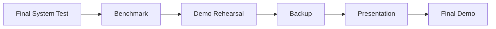

准备至少：

```text
Demo Video 1
Demo Video 2
Demo Video 3
```

同时准备一个 offline fallback：

```text
Precomputed annotation
```

如果现场 API / GPU / 网络出现问题，可以继续完成 Demo。

---

# 40. Demo Scenario

建议 Demo 使用一个非常容易理解的动作链。

例如：

```text
Pick up cup
      ↓
Pour water
      ↓
Place cup
```

用户上传视频。

系统显示：

```text
Processing...

Extracting frames
Detecting actions
Recognizing objects
Selecting keyframes
```

得到：

```text
00:00 – 04:20
PICK / CUP

04:20 – 10:30
POUR / CUP

10:30 – 15:80
PLACE / CUP
```

然后故意展示一个 AI 错误：

```text
AI prediction:

POUR / BOTTLE
confidence = 0.51
```

用户修改：

```text
BOTTLE → CUP
```

然后：

```text
Save
 ↓
Verified = true
 ↓
Export JSON
```

最终形成完整闭环。

---

# 41. Final Demo Story

Demo 不应该重点展示：

```text
我们使用了什么模型
```

而应该展示：

```text
Problem
 ↓
Manual annotation takes 15–30 minutes
 ↓
AI generates draft annotation
 ↓
Human only checks uncertain segments
 ↓
Annotation corrected in seconds
 ↓
Export dataset
 ↓
Future robot learning
```

最终强调：

> **The system does not try to remove the human from the loop. It removes unnecessary manual work.**

---

# 42. 系统设计中的关键 Trade-offs

## 42.1 VLM vs. Dedicated Action Recognition Model

### Dedicated model

优点：

* 推理稳定；
* latency 可控；
* 可以针对数据集优化。

缺点：

* 需要训练；
* ontology 固定；
* Hackathon 时间不足。

### VLM

优点：

* zero/few-shot；
* 快速开发；
* 对新 action 更灵活。

缺点：

* temporal precision 较弱；
* latency / cost 可能较高；
* 输出需要 schema constraint。

因此最终采用：

```text
VLM
+
Temporal Algorithm
```

---

# 43. 为什么不直接让 VLM 做全部工作？

因为：

```text
VLM
 ↓
"Person picks up a cup around 2 seconds"
```

并不意味着：

```text
start = 1.87
end = 4.31
```

时间边界需要更加稳定的 temporal signal。

因此：

```text
Temporal Algorithm
      +
VLM
```

比：

```text
VLM alone
```

更加适合本项目。

---

# 44. 为什么需要 Human-in-the-loop？

目标不是：

$$
Accuracy = 100\%
$$

而是：

$$
Cost_{AI+Human}
<
\frac{1}{3}Cost_{Manual}
$$

即使 AI 存在一定错误，只要：

```text
AI generates 80–90% correct draft
+
Human quickly fixes remaining errors
```

依然能够实现业务价值。

---

# 45. 未来扩展

当前系统：

```text
Video
 ↓
Structured Annotation
```

未来：

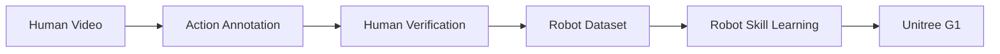

进一步可以加入：

* SAM 2 object tracking；
* Hand-object interaction；
* Object trajectory；
* Robot skill mapping；
* Demonstration learning；
* Imitation Learning；
* VLA models。

但是这些不属于当前 Hackathon MVP。

---

# 46. 最终技术方案总结

最终推荐方案：

```text
                 ┌──────────────────┐
                 │    Video Input   │
                 └────────┬─────────┘
                          ↓
                 ┌──────────────────┐
                 │ Preprocessing    │
                 │ FFmpeg / OpenCV  │
                 └────────┬─────────┘
                          ↓
                 ┌──────────────────┐
                 │ Frame Sampling   │
                 └────────┬─────────┘
                          ↓
                 ┌──────────────────┐
                 │ Temporal Signal  │
                 │ Embedding Change │
                 └────────┬─────────┘
                          ↓
                 ┌──────────────────┐
                 │ Candidate        │
                 │ Segmentation     │
                 └────────┬─────────┘
                          ↓
                 ┌──────────────────┐
                 │ VLM Semantic     │
                 │ Recognition      │
                 └────────┬─────────┘
                          ↓
             ┌────────────┼────────────┐
             ↓            ↓            ↓
          Action        Object      Keyframe
             │            │            │
             └────────────┼────────────┘
                          ↓
                 ┌──────────────────┐
                 │ Confidence       │
                 │ Estimation       │
                 └────────┬─────────┘
                          ↓
                 ┌──────────────────┐
                 │ Annotation JSON  │
                 └────────┬─────────┘
                          ↓
                 ┌──────────────────┐
                 │ Human Review     │
                 └────────┬─────────┘
                          ↓
                 ┌──────────────────┐
                 │ Versioned        │
                 │ Annotation       │
                 └────────┬─────────┘
                          ↓
                  ┌───────┴────────┐
                  ↓                ↓
              JSON Export      CSV Export
                  │
                  ↓
          Future Robot Dataset
```

核心原则可以总结为：

1. **不要从零训练大模型。**
2. **Temporal Segmentation 是 AI Pipeline 的核心难点。**
3. **采用 Visual Signal + VLM 的 Hybrid Architecture。**
4. **Action/Object 使用受限 ontology，而不是自由文本。**
5. **VLM 负责 semantic understanding，而不是单独负责精确 temporal localization。**
6. **SAM 2 作为 optional module，而不是核心依赖。**
7. **AI 输出必须是 Draft，Human Verification 是系统正式流程的一部分。**
8. **使用 confidence 驱动人工复核，最大化人工效率。**
9. **Annotation 使用结构化 JSON + Pydantic validation。**
10. **Backend 使用异步 Job，避免长时间 HTTP blocking。**
11. **UI 只实现 Timeline + Editor + Export，不投入大量时间做视觉设计。**
12. **第五天原则上不再进行高风险技术改动。**
13. **最终 Demo 应展示完整业务闭环，而不仅仅是模型预测。**
14. **系统架构预留 Robot Skill Mapping，但当前不实现机器人控制。**

最终产品定位：

> **An AI-assisted, human-in-the-loop video annotation system that converts human demonstrations into structured action datasets for future computer vision and robot learning applications.**
