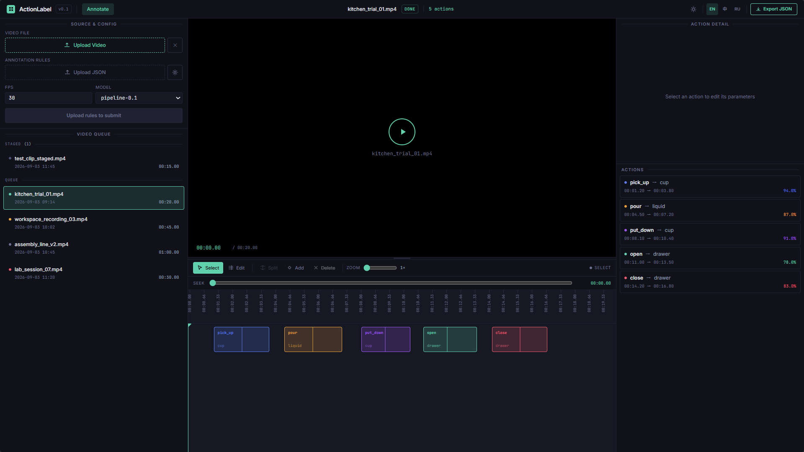

# Описание фронтэнда

Интерфейс будет с заголовком вверху. Под заголовком макет будет следовать схеме «слева-по центру-справа», как показано на изображении:

- Левая часть разделена на две колонки. Верхняя колонка отвечает за загрузку видео, правила аннотирования (в настоящее время загружаются в формате JSON) и другие настройки. Нижняя колонка отображает список загруженных видео.

- Средняя часть — это интерфейс предварительного просмотра видео, с окном предварительного просмотра, панелью инструментов и временной шкалой (интерактивно редактируемой) сверху вниз.

- Правая часть отображает список действий, сгенерированный после автоматизированного аннотирования с помощью модели ИИ. Он также разделен на два слоя: верхний слой отвечает за ручное изменение параметров выбранного действия, а нижний слой — это список аннотированных действий.

Основной рабочий процесс этой системы аннотирования выглядит следующим образом: пользователь задает правила аннотирования и параметры видео, затем загружает видео для обнаружения. После нажатия кнопки обнаружения, бэкэнд-модель ИИ автоматически выполняет аннотирование действий, получая список аннотированных действий (сохраненный и передаваемый в формате JSON) и обработанное видео. Фронтенд отображает загруженную видеозапись, предоставляя функции предварительного просмотра видео и настройки результатов аннотирования действий. На панели инструментов над временной шкалой предусмотрен ряд инструментов ручного аннотирования, позволяющих динамически настраивать временные метки начала и конца действий, объекты действий, ключевые кадры и т. д., а также позволяющих пользователям вручную редактировать временную шкалу.

[Ссылка на Figma](https://www.figma.com/make/i7PQqJP1qG6Ie0JVGy3kFZ/SPA-Video-Annotation-Frontend?t=FA6gLCUohgWr9np6-20&fullscreen=1)
